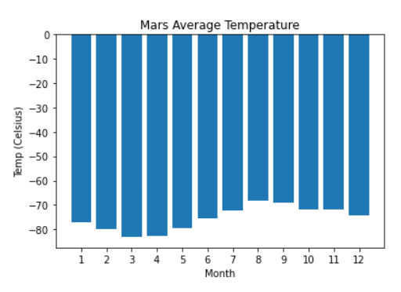
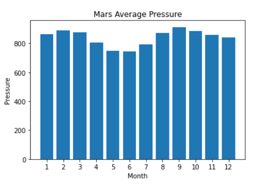
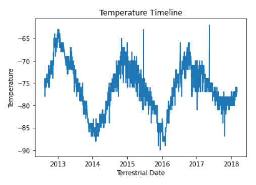

# Mission-to-Mars

## Overview of Project
The client is an ambitious aerospace company that’s doing research about resource extraction from nearby planets.

The request is to scrape, organize, analyze, and visualize the data. The focus is on gathering information about the climate of Mars.

## Results
The data was analyzed to answer the following questions:

1.  How many months exist on Mars?
    *  Mars has 12 months.

2.  How many Martian (and not Earth) days worth of data exist in the scraped dataset?
    *  There is 1867 Martian Days worth of data.

3.  What are the coldest and the warmest months on Mars?
    * The coldest was month number 3, with an average of -83 celsius. 
    * The warmest was month number 8, with an average of -68 celsius.

      

4.  Which months have the lowest and the highest atmospheric pressure on Mars?
    * The lowest atmospheric pressure was in month number 6, with an average of 745. 
    * The highest atmospheric pressure was in month number 9, with an average of 913.

      

5.  About how many terrestrial (Earth) days exist in a Martian year? 
    *  One year on mars is approximately 685 days on earth.

        
